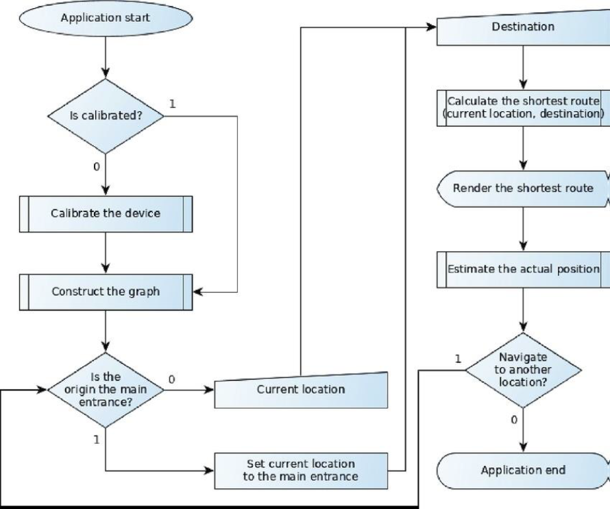

# AR_NAV_CAMP
Augmented Reality (AR) based Indoor Navigation Application
  
AR NAV CAMP project is motivated to build from the growing need for efficient indoor navigation solutions.
 
Traditional navigation apps are predominantly designed for outdoor use and are often ineffective within the confines of buildings. This limitation has led to frustration and time wastage for users trying to find specific locations indoors. Our project aims to address this issue and offer a more intuitive and user-friendly solution for indoor navigation.
 

<h2>Problem Statement</h2>
To tackle the lack of accurate and user-friendly indoor navigation tools.
 

<h2>Objective</h2>
1. Develop an AR-based indoor navigation system that can accurately guide users to their desired destinations within complex indoor environments. 
2. Create a user interface that is easy to understand and accessible.
3. Implement real-time positioning and mapping technology to provide up-to-date navigation instructions.
 

<h2>Architechture of the application</h2>
<h3>1. Hardware Components:</h3>
<b>1.1 User device:</b> To run application  
<b>1.2 Sensors:</b> Camera (captures user’s movements, orientations, and visual data for precise indoor positioning and AR overlays.)
  
<h3>2. Software Components:</h3>
<b>2.1 Operating System:</b> Android or IOS  
<b>2.2 AR Development Framework:</b> Unity, ARKit, or ARCore (These frameworks enable marker tracking, object recognition, and 3D rendering.)
  
<h3>3. Navigation Algorithm and Framework:</h3>
<b>3.1 Navigation System:</b> It employs advanced navigation algorithms to calculate optimal routes, handle pathfinding, and provide real-time instructions. It retraces the user's location, destination, and surrounding environment.  
<b>3.2 Positioning System:</b> The positioning system uses a device camera to determine the user's location accurately.
  
<h3>4. User Interface Framework:</h3>
<b>4.1 UI Components:</b> Components include maps, dropdown menu, and turn-by-turn instructions.  
<b>4.2 Design Principles:</b> The UI design adheres to user experience (UX) and user interface (UI) design principles, ensuring that information is presented clearly and accessible.
  
<h3>5. Integration and Compatibility:</h3>
<b>5.1 Device Compatibility:</b> The application is designed to be compatible with a range of user devices (smartphones and tablets). It adapts to different screen sizes and capabilities.  
<b>5.2 Operating System Compatibility:</b> The AR Indoor Navigation system of the AR NAV CAMP application seamlessly integrates with iOS and Android operating systems, optimizing performance and feature availability for each.
 

<h2>Process Design</h2>

<h2>Algorithm Used</h2>
<b>1. NavMesh tools</b> to generate a walkable surface map of the campus environment. Defined regions accessible to users, considering obstacles, buildings, and restricted areas.
  
<b>2. A* Algorithm</b> to calculate shortest path.

<h2>Design</h2>

Stage 1: Start of App
  

Stage 2: Homepage
  

Stage 3: Bracode Scanner
  

Stage 4: Loading Animation
  

Stage 5: Destination Selection using Drop-Down Box
  

Stage 6: Rendering Guidline
